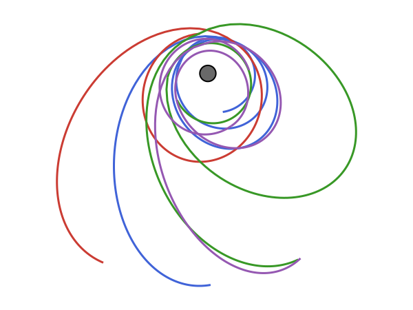

# BroadSearch

<div align="center">
    <picture>
      <source media="(prefers-color-scheme: dark)" 
        srcset="assets/logo.svg" >
      
    </picture>
</div>

[](https://github.com/burtony3/BroadSearch.jl/actions/workflows/CI.yml?query=branch%3Amain)

BroadSearch.jl provides tools for constructing and searching trajectory‐tree graphs of spacecraft missions using analytic or SPICE‐based ephemerides. You can define mission goals, cost functions, and policies to explore interplanetary transfer sequences with Lambert solvers.

---

## Installation

```julia
using Pkg
Pkg.add("BroadSearch")
````

<!-- Required dependencies are declared in the package. For SPICE functionality, also add:

```julia
Pkg.add(["SPICE", "Downloads"])
```
-->

---

## Quick Start

```julia
using BroadSearch, StaticArrays, Dates

# 1. Load built‐in ephemerides
data = DefaultEphemeris.basic
earth = data.earth
jupiter = data.jupiter

# 2. Define goal (arrive at Jupiter in ≤8 years with v∞ ≤7 km/s)
goal = ConstrainedArrival(jupiter, 7.0, 8 * 365 * 86400.0)

# 3. Cost: ∆v between 3 and 49 km/s
cost = BasicFlyby(3.0, 49.0)

# 4. Policy: flyby sequence [Venus, Earth, Mars, Jupiter], using LambertNode, max 70 nodes
policy = BasicPolicy(
    [data.venus, data.earth, data.mars, data.jupiter],
    [LambertNode],
    70
)

# 5. Departure window: Jan 1, 1989 → Jan 1, 1991
tspan = (DateTime(1989,1,1), DateTime(1991,1,1))

# 6. Initialize tree from Earth
tree = initialize_tree(goal, cost, policy, earth, tspan, 70)

# 7. Run depth‐first search (max depth = 5)
sols = search!(DepthFirst(5), tree; multithread = true)

# 8. Inspect top solution
sol = first(sort(sols, by = s -> norm(s.v∞)))
println("Sequence: ", sol.sequence)
println("Cost: ", sol.cost, "  Arrival v∞: ", norm(sol.v∞))
```

---

## Core API Summary

* **Ephemerides**

  * `DefaultEphemeris.basic`: Named tuple of analytic bodies (Sun, Mercury, … Jupiter, etc.)
  * `SpiceEphemeris`: SPICE‐kernel based ephemeris (requires `furnsh`‐ing kernels)

* **Goal & Cost**

  * `ConstrainedArrival(target::AbstractEphemeris, v∞_max::Real, tof_max::Real)`
  * `BasicFlyby(∆v_min::Real, ∆v_max::Real)`

* **Policy & Nodes**

  * `BasicPolicy(bodies::Vector{<:AbstractEphemeris}, nodetypes::Vector{Type{<:AbstractNode}}, pop_limit::Int)`
  * `LambertNode` (models a Lambert‐arc transfer)

* **Tree Construction & Search**

  * `initialize_tree(goal, cost, policy, departure::AbstractEphemeris, tspan::Tuple{DateTime,DateTime}, N::Int)`
  * `DepthFirst(max_depth::Int)`
  * `search!(strategy::DepthFirst, tree; multithread::Bool=false) → Vector{Solution}`

* **Plotting (optional)**

  * Use CairoMakie to visualize orbits (`lines!` on `policy.bodies`) and solutions (`lines!(ax, sols)` or `scatter!` with metrics).

---

## Contributing

1. Fork & clone the repo.
2. Create a branch:

   ```bash
   git checkout -b feature-x
   ```
3. Add tests under `test/`.
4. Run `] test BroadSearch` to ensure all checks pass.
5. Open a pull request with a clear description.

Please follow Julia style guidelines and add docstrings for new functionality.

---

## License

Released under the MIT License
